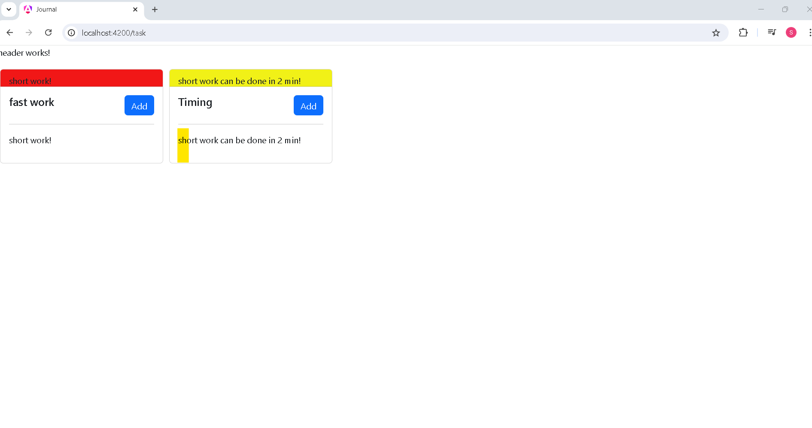
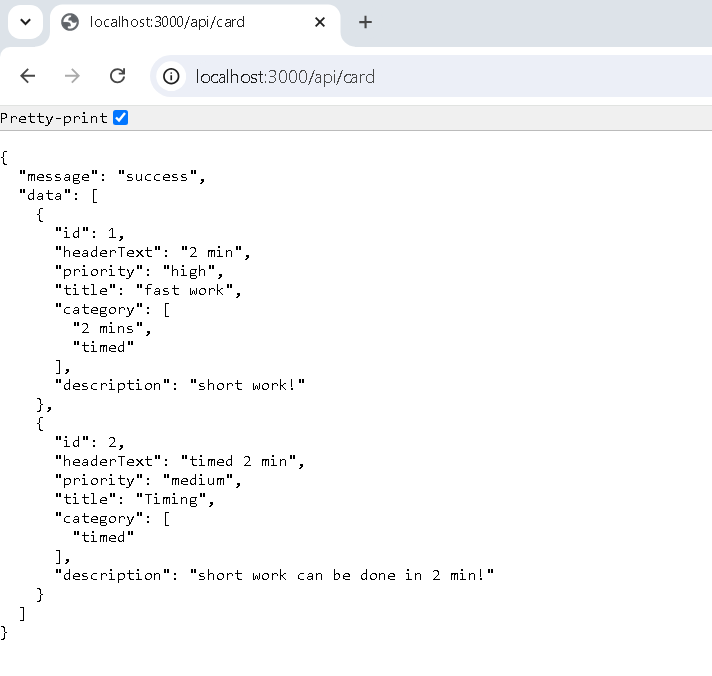

# Development

# Ui: journal

## 1.1 ui task screen

### 1.1 Description

**Created app journal**

### Tech used

##### Implement

-- general/reuse card.

# Backend: node journal

## 1.1 card data from api link

### 1.1 Description

**Created app to server api for journal**

### Tech used

##### Implement

-- create app with express and database with sqlite.
-- create an api called 'seed' to create table if not present in db.
-- created general query like create, select, select by id, to be used in other files.
-- created select query with constraints to retrive or fetch data from table.
